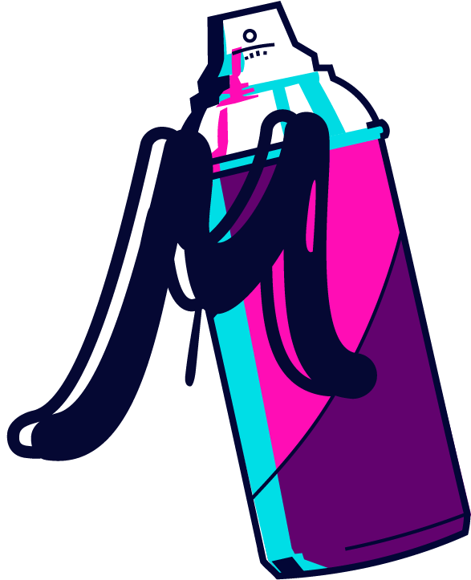
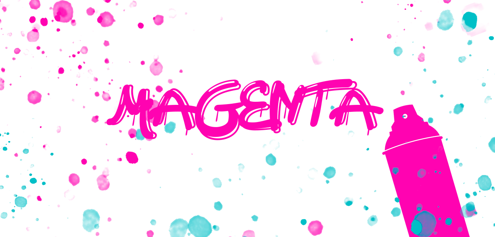
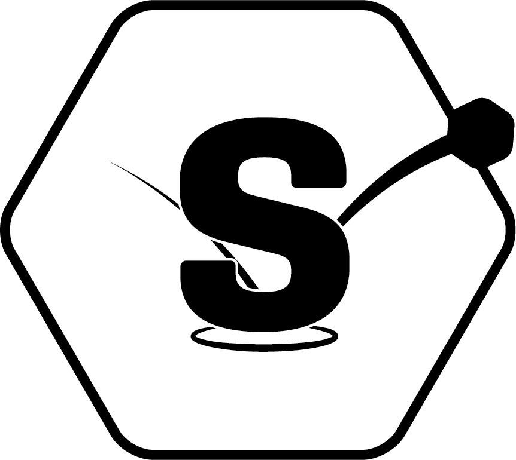
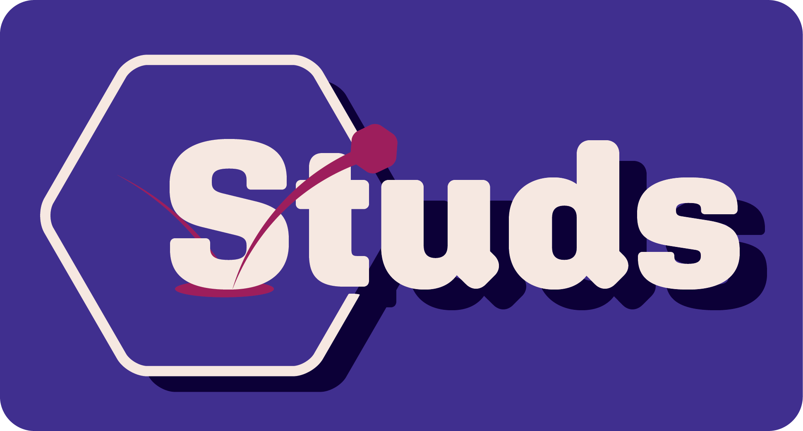

<!-- Title and Logo -->
 

<h1 id="header" align="center">
    Hi, I'm Julia!
</h1>

### About me

I'm currently studying Computer Science at KTH :school:. I'm also a TA in DH2642 and DM1595 at KTH, teaching the basics of frontend development.

- :art: Painting/Graphic Design, :camera: Photography and :musical_score: Music is what I do on the side.
- :musical_keyboard: I love playing the piano
- :zap: Currently learning more about game development. 

---

### :wrench: Languages, frameworks and tools

    
    
    
    
    
    
    
    
    
    
    
    
    
    
    
    
    
    
    

---

### :black_nib: Graphics

    
    

    
    

---

<h1 align="center">
      
</h1>

